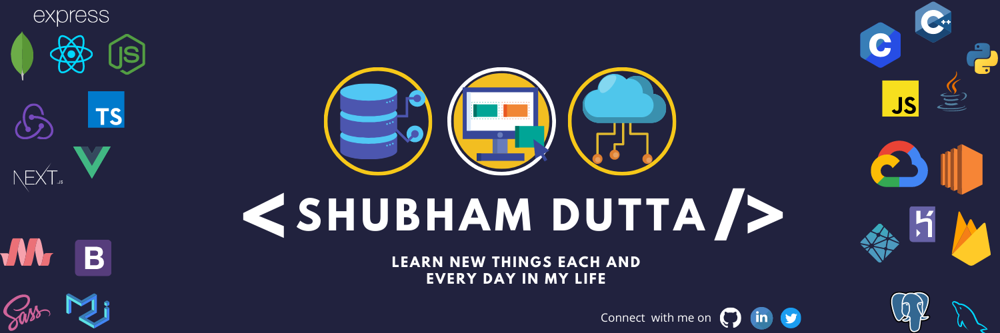

</a>

<h3 align="center">Hello, folks! , I'm Shubham Dutta. </h3>

<h4 align="center"> Software Developer, currently pursuing my B.Tech degree in CSE from University of Engineering & Management, Kolkata. </h4>

## BIO

Full Stack MERN/MEVN Web Developer. Also efficient in working with Django Full stack, WAMP stack, Server management automation using Bash, in Web App Development. I have great communication and management skills. Also I am proficient in Computer networking, DevOps and System Administration.
 

<table style="border: none">
  <tr >
  <td width="42%">

## My Works

|      💼 Designation       |                             🏢Organization                              |      ⏰Timeline      |
| :-----------------------: | :---------------------------------------------------------------------: | :------------------: |
|   Technical Instructor    |                      [@IEMA](https://iemlabs.com)                       | April 2021 - Present |
|   Software Developer Intern    |                      [@IEMA](https://iemlabs.com)                       | April 2021 - Present |
| Software Developer Intern | [@Quordnet-Academy](https://www.linkedin.com/company/quordnet-academy/) | Sep 2020 - Mar 2021  |
| Founding Member & Web Developer | [@Hack Club Uemk]() | June 2020 - June 2021 |

- 👯 I’m looking to collaborate Full Stack development Projects
- 😄 Passion: | Developer | Coder | Tech lover | Music | Contributor

  </td>
  
  <td width="58%" valign="top">
  
  </td>
  </tr>
</table>

 

## Skilled in

### Languages:

### Web Development (Full-stack):

#### Frontend/UI:

 

#### Backend/Server:

#### Database:

#### Microservices

 
### Dev-Ops:

 

### Others:

 

## 🏆 Github Profile Trophy </h2>

  

 

## Overall Profile Stats

<table>
  <tr >
      <td align="right" valign="top">
        
    </td>
    <td valign="top">
      
    </td>

  </tr>
</table>

 

### CONNECT WITH ME ON

    &nbsp;&nbsp;
    
    &nbsp;&nbsp;
    
    &nbsp;&nbsp;

